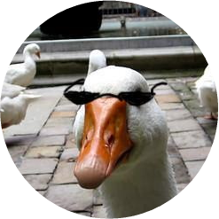

  

<h1 align="center">MattMoony.github.io</h1>

    

## ✍ About

I have _finally_ convinced myself to work on my website again. This repository will contain the whole source as I am going to be hosting it with [GitHub pages](https://pages.github.com/). Yeah... There's not really much to tell apart from that. So... please, do tell if you dislike it or find any problems, but, of course, also feel free to tell me if you enjoy it 😅.

▶ **The end result of this endeavour can be seen on [mattmoony.github.io](https://mattmoony.github.io).**

## 🔗 References

* [Gatsby](https://www.gatsbyjs.org/) - React framework for static pages
* [React](https://reactjs.org/) - _"A JavaScript library for building user interfaces"_
* [Piskel](https://github.com/piskelapp/piskel) - Open-source tool for creating lovely pixel art
